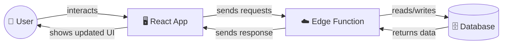
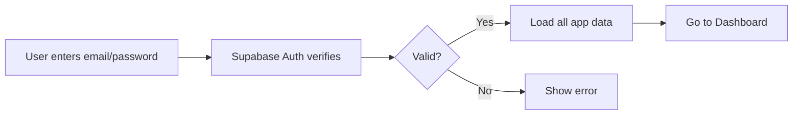
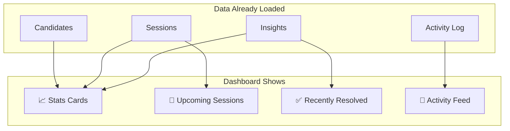
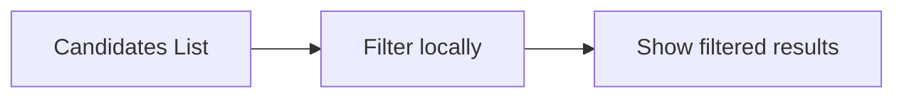
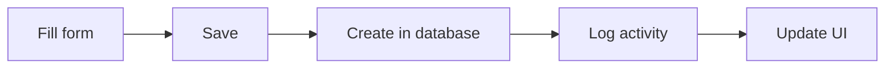
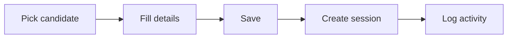
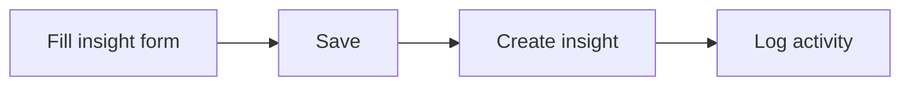
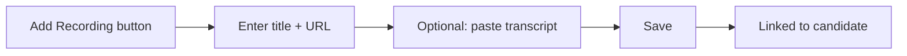
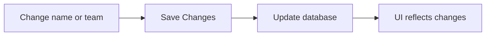
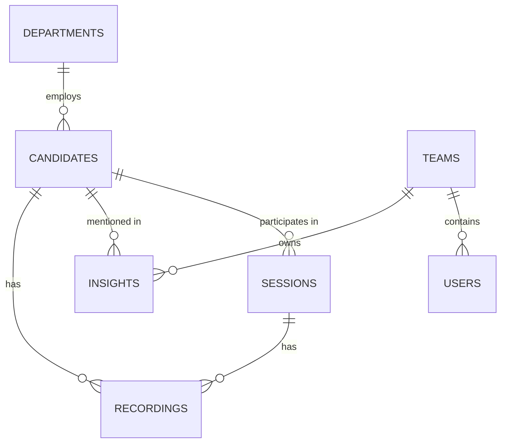

# User Research Hub - Data Flow Guide

A simplified overview of how data moves through the app for each screen.

---

## 🏗️ How the App Works (Big Picture)



### The Three Layers

| Layer | What it does |
|-------|--------------|
| **React App** | What users see and interact with |
| **Edge Function** | The middleman that talks to the database |
| **Database** | Where all the data lives (Supabase PostgreSQL) |

---

## 🔐 Login Flow



**What happens:** User signs in → App fetches ALL data at once → User sees the dashboard

---

## 📊 Dashboard



**No new data requests!** Dashboard uses data already loaded when user logged in.

| Card | Counts... |
|------|-----------|
| Upcoming Sessions | Sessions with status "Scheduled" |
| To be Scheduled | Candidates waiting to be scheduled |
| Open P0 Insights | High-priority unresolved insights |
| Under Development | Insights being worked on |

---

## 👥 Candidates

### Viewing Candidates



**Filtering happens in the browser** - no new database requests when you search or filter.

### Adding a Candidate



**What gets saved:**

| Field | Where it goes |
|-------|---------------|
| Name, Title, Location | `candidates` table |
| Department | Links to `departments` table |
| Status, Features, Notes | `candidates` table |

**Automatically logged:** "Sarah added candidate John Doe" appears in activity feed

---

## 📅 Sessions

### Creating a Session



**What gets saved:**

| Field | Where it goes |
|-------|---------------|
| Candidate | Links to `candidates` table |
| Product, Features | `sessions` table |
| Date, Time, Duration | `sessions` table |
| Moderator | `sessions` table |

**Automatically logged:** "Sarah scheduled a session with John Doe"

---

## 💡 Analysis & Insights

### Creating an Insight



### Changing Insight Status

```mermaid
flowchart LR
    A[Click status dropdown] --> B[Select new status]
    B --> C[Update database]
    C --> D{Resolved?}
    D -->|Yes| E[Log "insight resolved"]
    D -->|No| F[Just update UI]
```

**Status options:** Picked up → Under development → Resolved / Skipped

**Automatically logged when resolved:** "Sarah resolved insight 'Confusing button label'"

---

## 🎬 Recordings

### Adding a Recording



**Recordings can have:**
- Video link (YouTube, Loom, etc.)
- Text transcript
- Or both!

---

## 👑 Admin

### Inviting a User

```mermaid
flowchart LR
    A[Click Invite User] --> B[Fill name, email, role, team]
    B --> C[Send invitation]
    C --> D[User appears as "Invited"]
```

**Roles:** Admin, Researcher, Viewer  
**Teams:** FE, PM, UX

---

## ⚙️ Settings

### Updating Profile



**Can change:** Name, Team  
**Can't change:** Email (locked to login)

---

## 🗄️ What's in the Database?



### Main Tables

| Table | What it stores |
|-------|----------------|
| `candidates` | Research participants |
| `sessions` | Scheduled/completed research sessions |
| `insights` | Findings from research |
| `recordings` | Video links & transcripts |
| `users` | Team members using the app |
| `activity_logs` | Automatic history of actions |
| `departments` | Engineering, Product, Design, etc. |
| `teams` | FE, PM, UX |

---

## 🔄 Activity Logging (Automatic!)

The app automatically tracks these events:

| Action | What's logged |
|--------|---------------|
| Add candidate | "Sarah added candidate John Doe" |
| Change candidate status | "Sarah changed John's status from Scheduled to Completed" |
| Schedule session | "Sarah scheduled a session with John Doe" |
| Create insight | "Sarah created insight 'Button too small'" |
| Resolve insight | "Sarah resolved insight 'Button too small'" |

This feeds into the **Activity Feed** on the Dashboard.

---

## 🎯 Quick Reference: What Happens When...

| User Action | Database Changes |
|-------------|------------------|
| Sign in | Nothing (just auth) |
| View any page | Nothing (data already loaded) |
| Filter/search | Nothing (done locally) |
| Add candidate | New row in `candidates` + activity log |
| Add session | New row in `sessions` + activity log |
| Add insight | New row in `insights` + activity log |
| Change insight status | Update `insights` row + maybe activity log |
| Add recording | New row in `recordings` |
| Invite user | New row in `users` |
| Update profile | Update row in `users` |

---

## 📱 Page → Data Summary

| Page | Reads From | Writes To |
|------|------------|-----------|
| Dashboard | candidates, sessions, insights, activity | nothing |
| Candidates | candidates, products | candidates, activity_logs |
| Candidate Detail | candidates, sessions, insights, recordings | candidates, insights, recordings |
| Sessions | sessions, candidates | sessions, activity_logs |
| Session Detail | sessions, candidates | nothing (read-only) |
| Analysis | insights, candidates, products | insights, activity_logs |
| Recordings | recordings, candidates, sessions | recordings |
| Admin | users, products | users |
| Settings | users, teams | users |
